# Laporan Akhir Jaringan Komputer - Modul 4: Firewall & NAT

## 1. Topologi Jaringan Enterprise
Infrastruktur simulasi dikonfigurasi pada *server* PNET Lab dengan arsitektur *multi-vendor* yang memisahkan area menjadi tiga zona utama: *External WAN*, *Internal LAN*, dan *Demilitarized Zone* (DMZ).

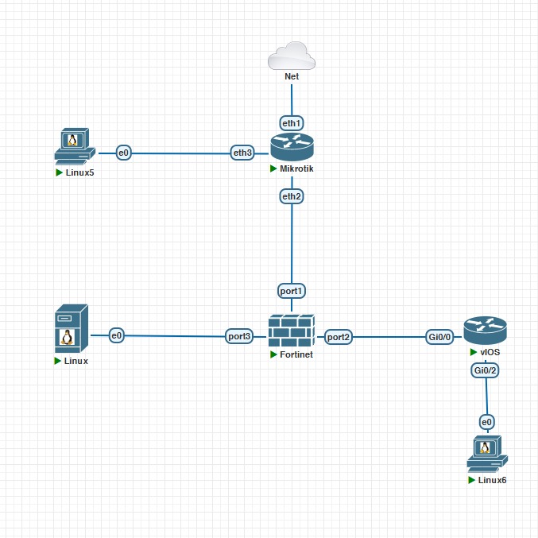
*Gambar 1.1: Skema Topologi Jaringan Enterprise Multi-Vendor*

---

## 2. Segmentasi & Tabel IP Address

| Perangkat | Antarmuka (Interface) | Alamat IP | Gateway | Deskripsi |
| :--- | :--- | :--- | :--- | :--- |
| **MikroTik ISP** | `ether1` `ether2` `ether3` | DHCP Client 10.10.10.1/30 172.16.100.1/24 | DHCP - - | Uplink ke Jaringan Lab Link menuju FortiGate port1 Gateway Segmen Client-WAN |
| **FortiGate** | `port1` `port2` `port3` | 10.10.10.2/30 10.20.20.1/30 192.168.20.1/24 | 10.10.10.1 - - | Antarmuka luar (WAN) Jalur INSIDE ke Cisco Router Gateway lokal zona DMZ |
| **Cisco Router** | `Gi0/0` `Gi0/2` | 10.20.20.2/30 192.168.10.1/24 | 10.20.20.1 - | Uplink menuju FortiGate port2 Gateway lokal zona LAN |
| **Client LAN (Tinycore)** | `eth0` | 192.168.10.10/24 | 192.168.10.1 | Host internal privat (Linux6) |
| **Client WAN (Tinycore)** | `eth0` | 172.16.100.10/24 | 172.16.100.1 | Host eksternal luar (Linux5) |
| **Ubuntu Server DMZ** | `eth0` | 192.168.20.10/24 | 192.168.20.1 | Web Server Nginx internal DMZ |

---

## 3. Konfigurasi Tiap Perangkat

### A. MikroTik ISP
[cite_start]Mengonfigurasi pengalamatan IP di setiap *interface*, mengaktifkan DHCP Client pada `ether1` untuk akses internet utama lab, serta menetapkan aturan NAT *masquerade* pada jalur keluar[cite: 723].

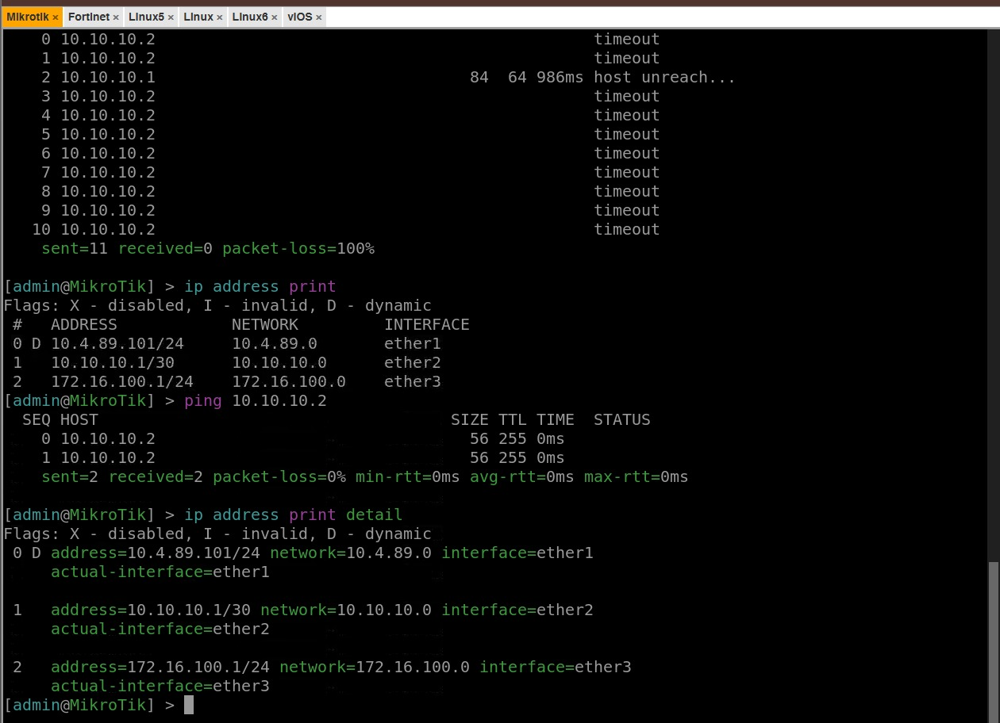
*Gambar 3.1: Alokasi IP Address dan Informasi Routing MikroTik ISP*

### B. Firewall FortiGate
1. [cite_start]**Pengaturan Interface & Akses Manajemen:** Menetapkan IP statis pada `port1`, `port2`, dan `port3` beserta otorisasi protokol akses manajemen (`allowaccess ping https ssh http`)[cite: 724].
2. [cite_start]**Routing Table:** Menambahkan rute *default* `0.0.0.0/0` via `10.10.10.1` dan *static route* `192.168.10.0/24` via `10.20.20.2`[cite: 501, 504].

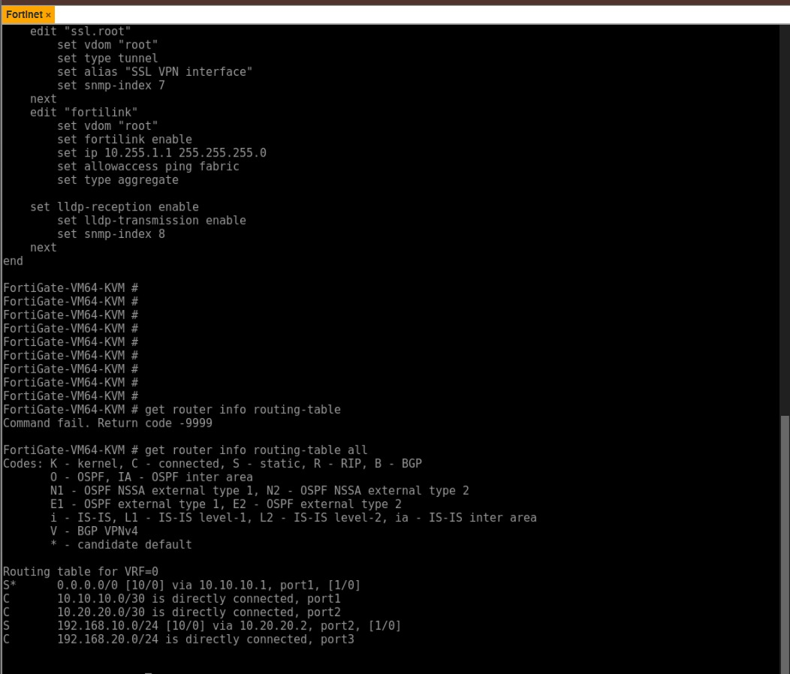
*Gambar 3.2: Routing Table Terdaftar pada Sistem FortiGate*

3. **Firewall Policy & VIP (Virtual IP):**
   - [cite_start]Aturan `LAN_to_WAN` (NAT Aktif) dan `LAN_to_DMZ` (NAT Nonaktif)[cite: 553, 554].
   - [cite_start]Aturan `WAN_to_DMZ_HTTP` dengan Virtual IP `DMZ_HTTP` untuk meneruskan lalu lintas port 80 publik ke internal server[cite: 555].

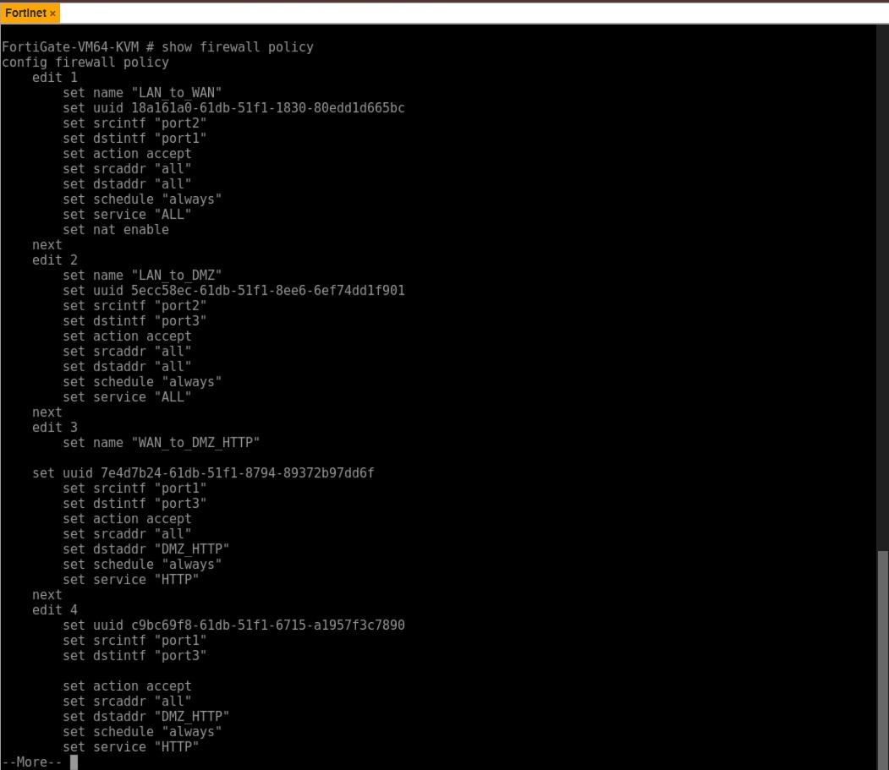
*Gambar 3.3: Konfigurasi Security Policy Inter-Zone Sisi Dalam*

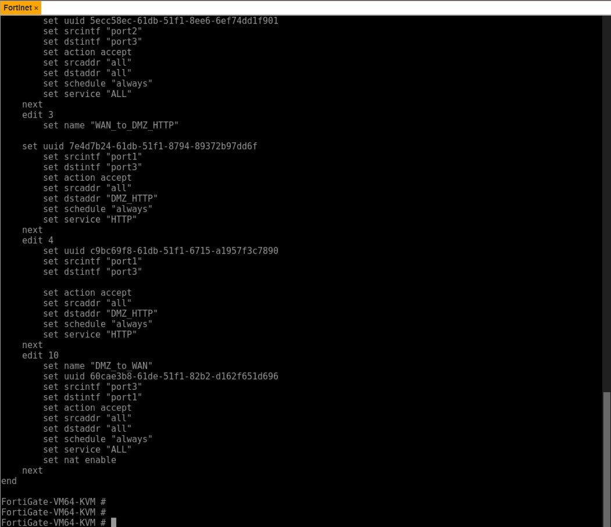
*Gambar 3.4: Kebijakan Akses Zona WAN menuju Area DMZ*

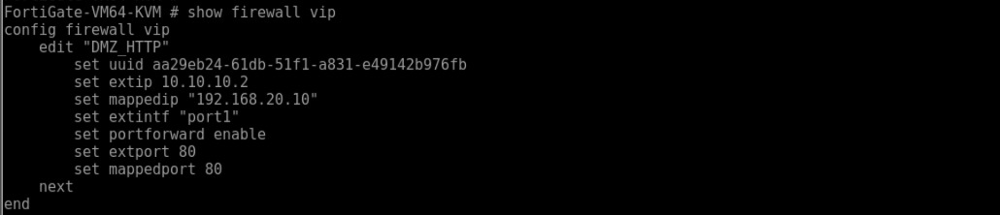
*Gambar 3.5: Struktur Aturan Port Forwarding Virtual IP (VIP)*

### C. Cisco Router
[cite_start]Melakukan inisialisasi alamat IP pada port `Gi0/0` dan `Gi0/2`, mengaktifkan fisik antarmuka (`no shutdown`), serta menetapkan rute *default* ke arah INSIDE FortiGate[cite: 725].

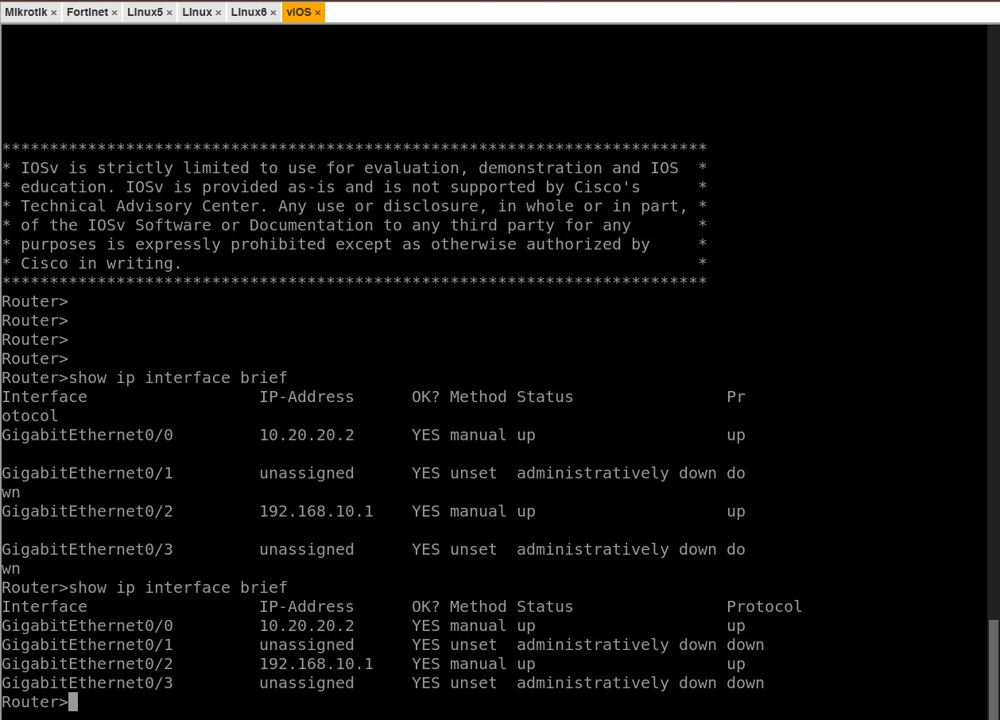
*Gambar 3.6: Status Interface Logis dan IP Address Cisco vIOS*

### D. End-Device & Server Setup
1. [cite_start]**Client LAN (Linux6):** Penyelarasan profil jaringan IP `192.168.10.10` dan *gateway* `192.168.10.1`[cite: 297, 298].
2. [cite_start]**Client WAN (Linux5):** Penyelarasan profil jaringan IP `172.16.100.10` dan *gateway* `172.16.100.1`[cite: 318, 319].

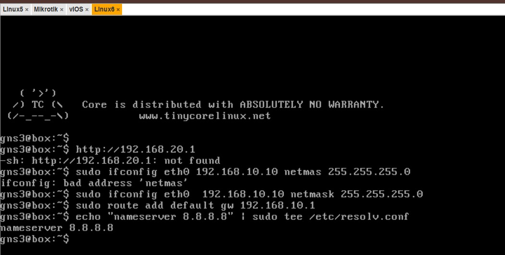
*Gambar 3.7: Parameter Network Profile pada Host Client LAN*

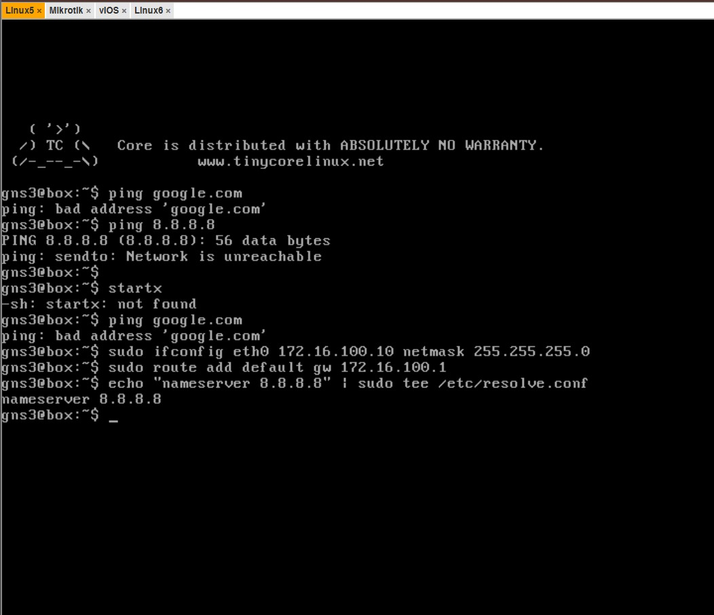
*Gambar 3.8: Parameter Network Profile pada Host Client WAN*

3. [cite_start]**Ubuntu Server DMZ:** Penyetelan IP statis, instalasi paket Nginx, serta kustomisasi file `index.html` sesuai format nama kelompok praktikan[cite: 325, 328, 329, 726].

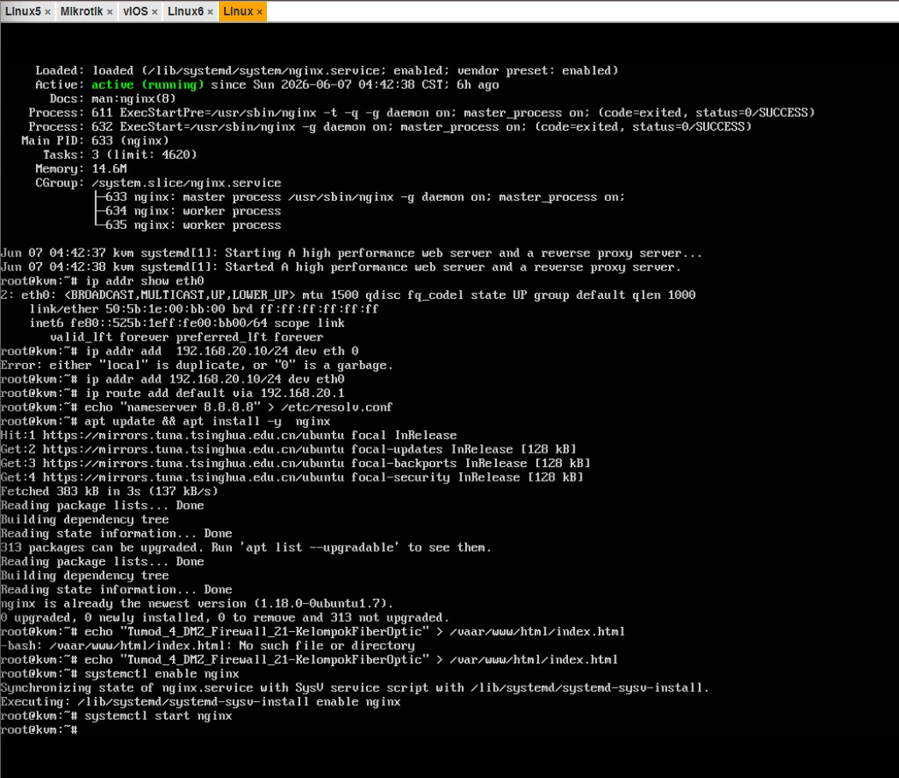
*Gambar 3.9: Status Berjalan Nginx dan Modifikasi Berkas HTML Server DMZ*

---

## 4. Hasil Pengujian Konektivitas

### A. Pengujian Multi-Directional dari Firewall FortiGate
[cite_start]Eksekusi pengujian interkoneksi langsung menggunakan perintah `execute ping` dari kontrol pusat FortiGate ke seluruh arah *gateway node* pendukung (MikroTik, Cisco, Ubuntu DMZ, dan DNS Internet)[cite: 674, 675, 676, 677, 678].

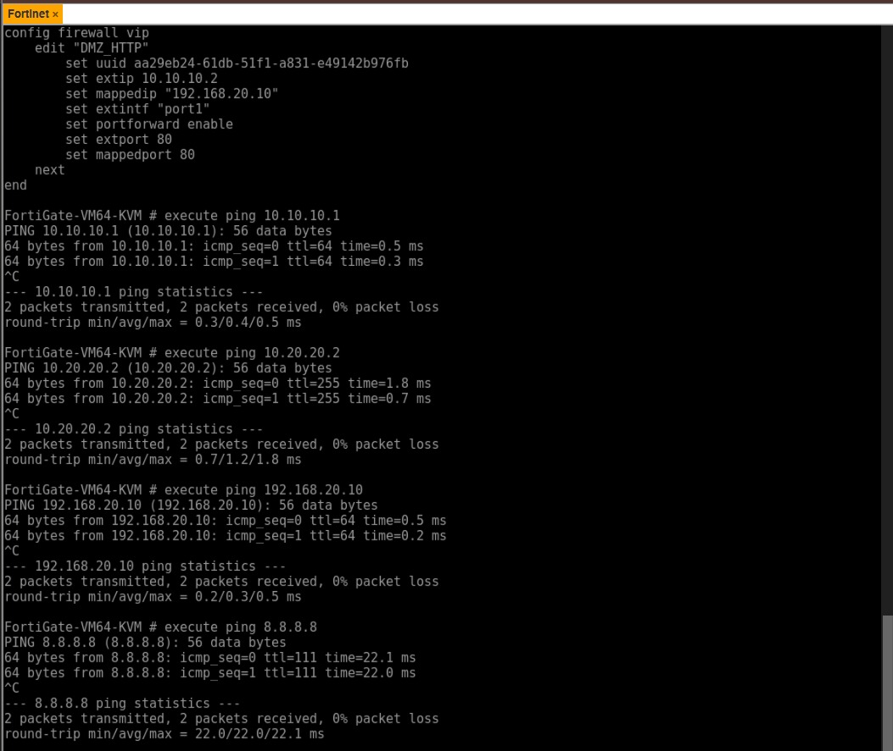
*Gambar 4.1: Log Output Validasi Koneksi Ping dari Sisi FortiGate*

### B. Pengujian Konektivitas Internal dari Cisco Router
[cite_start]Verifikasi koneksi balik dari area distribusi lokal Cisco Router menuju *gateway interface* FortiGate, IP internal Ubuntu DMZ, serta jaringan internet luar[cite: 396, 403, 407].

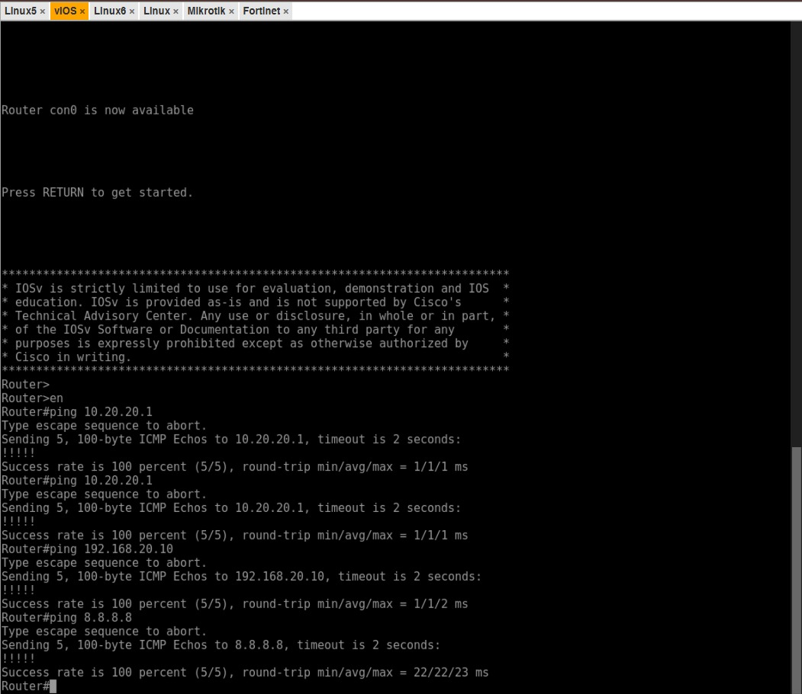
*Gambar 4.2: Log Output Validasi Koneksi Ping melalui Cisco Router*

### C. Pembuktian Akses Lintas Zona & Aturan Filtrasi
1. [cite_start]**Client LAN ke Gateway Cisco, FortiGate, & DMZ:** Berhasil terkoneksi secara transparan (Reply)[cite: 727].
2. [cite_start]**Client LAN Akses HTTP DMZ:** Membuka browser ke `http://192.168.20.10` memuat halaman kustom kelompok praktikan dengan sukses[cite: 727].
3. **Client WAN Ping ke ISP & FortiGate:** Koneksi antarmuka luar berhasil terhubung (Reply).
4. [cite_start]**Client WAN Akses HTTP VIP (`http://10.10.10.2`):** Berhasil memuat halaman Nginx kustom milik Ubuntu DMZ, membuktikan translasi *Destination NAT / Port Forwarding* pada FortiGate bekerja sempurna[cite: 728, 729].
5. [cite_start]**Isolasi Keamanan (Restriksi Paket):** Client WAN mencoba melakukan ping ke IP privat Client LAN maupun IP asli internal DMZ menghasilkan status *Request Time Out* (RTO)[cite: 729]. [cite_start]Kebijakan ini membuktikan pertahanan perimeter jaringan internal bekerja optimal untuk menahan *scanning* dari luar[cite: 729].

---

## 5. Analisis Hasil dan Kesimpulan

### Analisis Hasil
[cite_start]Tugas modul ini berhasil mengimplementasikan skenario jaringan enterprise berbasis arsitektur *multi-vendor* dengan memanfaatkan keunggulan fungsionalitas dari masing-masing perangkat[cite: 722]. [cite_start]Dengan menempatkan **FortiGate** sebagai pusat kendali utama jaringan (*central stateful firewall*), pemisahan hak akses data antar-zona (*WAN, LAN, dan DMZ*) dapat ditegakkan secara presisi melalui kombinasi *Security Policy* dan *Address Object*[cite: 553, 554, 555, 724].

[cite_start]Penerapan *Source NAT* (Masquerade) pada MikroTik dan FortiGate memberikan efisiensi translasi alamat IP privat lokal area dalam agar tetap mampu menginisiasi koneksi keluar ke internet publik[cite: 553, 723]. [cite_start]Di sisi lain, implementasi *Destination NAT* melalui objek *Virtual IP* (VIP) pada port 80 membuktikan bahwa penyediaan layanan publik—seperti *Web Server Nginx* di dalam zona DMZ—dapat dipublikasikan secara transparan ke dunia luar tanpa perlu mengekspos skema topologi privat maupun *resource* penting di area LAN[cite: 660, 724, 729]. 

[cite_start]Aturan filtrasi paket terbukti konsisten di mana akses publik dari luar (WAN) dibatasi secara ketat hanya diizinkan menggunakan protokol HTTP [cite: 555][cite_start], sedangkan aktivitas *probing/reconnaissance* berbahaya seperti utilitas paket ICMP (ping) langsung diblokir total (*Request Time Out*) oleh kebijakan firewall[cite: 729].

### Kesimpulan
1. [cite_start]**FortiGate** sukses beroperasi sebagai pusat pengamanan perimeter (*central stateful firewall*) enterprise lintas zona melalui pendefinisian aturan policy yang ketat[cite: 724].
2. [cite_start]Mekanisme **Virtual IP (VIP) / Port Forwarding** berhasil memetakan permintaan publik eksternal menuju infrastruktur server terisolasi pada DMZ secara transparan dan aman[cite: 660, 724].
3. [cite_start]Segmentasi jaringan *enterprise multi-vendor* ini menjamin tercapainya aspek *confidentiality* dan *availability* layanan tanpa mengorbankan integritas data privat pada area LAN lokal[cite: 729, 730].
